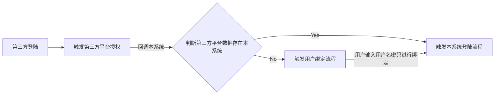

[TOC]

## 目标

*  了解JustAuth对接SpringSecurity通用第三方登陆

  参考：[JustAuth](https://justauth.wiki/#/quickstart/explain)

  [SpringSecurity实战(五)-认证流程源码分析](https://gengzi.github.io/Code-animal/#/./docs/SpringSecurity/SpringSecurity%E5%AE%9E%E6%88%98(%E4%BA%94)-%E8%AE%A4%E8%AF%81%E6%B5%81%E7%A8%8B%E6%BA%90%E7%A0%81%E5%88%86%E6%9E%90)

  [查看github账户授予权限的应用](https://github.com/settings/applications)

  [markdown画流程图，流程图语法](https://blog.csdn.net/qq_42874547/article/details/97801216)

上篇已经介绍了第三方登陆相关概念和一些流行框架。

## 通用第三方登陆设计

需求：参考Gitee 网站的第三方登陆实现流程，将其他第三方平台接入系统，并融入SpringSecurity的管理中。

选用框架：基于Justauth框架的实现，对接Spring Security。（如果不使用Spring Security，只需要使用justauth框架即可。）

登陆流程：



第三方登陆分两种情况：
1，（已绑定用户）第三方平台授权，直接登陆
2，（未绑定用户）第三方平台授权，用户绑定后，登陆

<div align="center">
    
    
    
</div>

 

### 思路

关于第三方登陆实现：

直接参考 JustAuth 提供的说明文档，简单明了。[JustAuth](https://justauth.wiki/#/quickstart/explain)

关于对接Spring Security的思路：

在前几篇介绍中，我们使用了Spring Security 进行系统的认证和授权，提供了基于用户名和密码表单登陆的方式，并且使用了Spring Session 和 Redisson 框架来管理会话信息。那么第三方登录将作为本系统用户登陆方式的一种扩展，我们期望不要由于第三方登录的出现，修改之前的认证授权流程和会话管理。所以自定义一套认证流程是一个不错的选择。

有一个大家比较关心的问题：

**第三方用户信息怎么与现有用户系统整合？**

最简单的就是设计一张第三方用户信息表，将第三方用户信息绑定到现有用户信息上。在登陆过程后，将第三方用户信息替换为现有用户信息实现登陆。

```sql
-- 第三方系统用户表
CREATE TABLE `other_sys_user` (
  `id` bigint(20) NOT NULL AUTO_INCREMENT COMMENT '主键',
  `scope` varchar(64) DEFAULT NULL COMMENT '第三方系统',
  `uuid` varchar(64) DEFAULT NULL COMMENT '第三方系统唯一账户',
  `user_id` bigint(20) DEFAULT NULL COMMENT '关联系统用户表的id',
  `username` varchar(64) DEFAULT NULL COMMENT '登陆用户名',
  `create_time` datetime DEFAULT NULL COMMENT '绑定时间（创建时间）',
  `update_time` datetime DEFAULT NULL COMMENT '更新时间',
  PRIMARY KEY (`id`),
  KEY `idx_user_id` (`user_id`) USING BTREE COMMENT '用户id索引'
) ENGINE=InnoDB DEFAULT CHARSET=utf8;
```

一个现有用户可能会匹配多个第三方系统的用户信息（1：n）。

JustAuth也给出一种登陆方案： [JustAuth与用户系统整合流程图](https://justauth.wiki/#/ext/justauth_integrated_with_the_existing_account_system) 可以参考学习

**怎么设计一个通用的第三方登陆实现呢？**

无论是要对接哪个平台，只需简单的配置，就可以实现第三方系统登陆。

每个平台厂商对OAuth2的实现不同，api接口等会不一样。JustAuth框架提供了大多数平台的对接接口，在一定程度上屏蔽了登陆的平台差异。对于我们实现的难点，在于怎么知道用户选择了那个第三方平台授权登陆。想知道这个很easy，用户使用哪个平台登陆，就将对应平台的syscode（比如 qq，github等等），当做参数传入。

#### 自定义登陆流程

根据上述的登陆流程，会细分出两个认证流程：

1. 已经绑定现有用户的情况下（说明之前已经使用第三方登陆，登陆本系统）。

   点击第三方登陆，直接登陆本系统

2. 没有绑定现有用户的情况下（说明第一次使用第三方登陆，登陆本系统）。

   点击第三方登陆，判断没有绑定用户，跳转绑定用户界面，绑定后登陆

``` flow
st=>start: 开始
e=>end: 结束
e1=>end: 结束
op1=>operation: OAuth2LoginController
op3=>operation: /api/login/{sys} 重定向第三方登陆页面
op2=>operation: Stuff
op4=>operation: 第三方登陆发起回调
op5=>operation: AbstractAuthenticationProcessingFilter -- doFilter()
op6=>inputoutput: OtherSysOauth2LoginFilter -- attemptAuthentication():>https://github.com/gengzi/gengzi_spring_security/blob/master/gengzi_spring_security/src/main/java/fun/gengzi/gengzi_spring_security/filter/OtherSysOauth2LoginFilter.java
op7=>inputoutput: OtherSysOauth2LoginAuthenticationToken:>https://github.com/gengzi/gengzi_spring_security/blob/master/gengzi_spring_security/src/main/java/fun/gengzi/gengzi_spring_security/token/OtherSysOauth2LoginAuthenticationToken.java
op8=>operation: ProviderManager
op9=>inputoutput: OtherSysOauth2LoginProvider -- authenticate():>https://github.com/gengzi/gengzi_spring_security/blob/master/gengzi_spring_security/src/main/java/fun/gengzi/gengzi_spring_security/provider/OtherSysOauth2LoginProvider.java
op10=>inputoutput: OtherSysOauth2LoginUserDetailsServiceImpl -- loadUserByUsername():>https://github.com/gengzi/gengzi_spring_security/blob/master/gengzi_spring_security/src/main/java/fun/gengzi/gengzi_spring_security/service/impl/OtherSysOauth2LoginUserDetailsServiceImpl.java
op11=>operation: 跳转到绑定登陆页面
op12=>operation: 用户输入用户名和密码绑定登陆
op13=>operation: AbstractAuthenticationProcessingFilter -- doFilter()
op14=>inputoutput: UserBindFilter -- attemptAuthentication():>https://github.com/gengzi/gengzi_spring_security/blob/master/gengzi_spring_security/src/main/java/fun/gengzi/gengzi_spring_security/filter/UserBindFilter.java
op15=>operation: BindAuthenticationToken:>https://github.com/gengzi/gengzi_spring_security/blob/master/gengzi_spring_security/src/main/java/fun/gengzi/gengzi_spring_security/token/BindAuthenticationToken.java
op16=>operation: ProviderManager
op17=>operation: BindLoginProvider -- authenticate():>https://github.com/gengzi/gengzi_spring_security/blob/master/gengzi_spring_security/src/main/java/fun/gengzi/gengzi_spring_security/provider/BindLoginProvider.java
op18=>operation: UserDetailsService -- loadUserByUsername()
op19=>operation: 执行认证成功事件或者失败事件
op20=>operation: 执行认证成功事件或者失败事件
 
cond=>condition: 用户选择是否授权？
cond1=>condition: 用户是否已经绑定？
 
st->op1->op3->cond
cond(yes)->op4->op5->op6->cond1
cond1(yes)->op7->op8->op9->op10->op20
cond1(no)->op11->op12->op13->op14->op15->op16->op17->op18->op19
op20->e
op19->e1
 
 
 
```

平行四边形中就是需要创建的类。

**其实OtherSysOauth2LoginAuthenticationToken 以及后面的认证（Provider）用户详情服务可以不用重新创建，直接使用UsernamePasswordAuthenticationToken那一套就可以了。但是为了演示整个认证流程，我还是重写了Token以及认证（Provider）和用户详情服务，万一用上了呢。**

## 代码实现

项目环境：spring boot 2.2.7 Jpa java8 mysql5.7 JustAuth1.15.8

代码参考：https://github.com/gengzi/gengzi_spring_security/tree/master/gengzi_spring_security

### 核心依赖

```xml
       <!--   JustAuth 对接第三方登陆框架     -->
        <dependency>
            <groupId>me.zhyd.oauth</groupId>
            <artifactId>JustAuth</artifactId>
            <version>1.15.8</version>
        </dependency>
 
```

JustAuth 官方文档参考： https://justauth.wiki/#/

数据库文件：[sys_manager.sql](https://github.com/gengzi/gengzi_spring_security/tree/master/gengzi_spring_security/src/main/resources/db)

### 创建第三方授权应用

不介绍了，直接参考把，写的非常清楚。

https://justauth.wiki/#  集成第三方部分。

主要是配置一下回调地址（redirectUri ），例如：http://localhost:8081/api/v1/oauth/callback/{sysCode}

注意最后一个参数sysCode ，就是对应平台的code，这也是实现通用第三方登陆的关键。

比如Github网站OAuth2应用，配置：http://localhost:8081/api/v1/oauth/callback/github

比如Gitee网站OAuth2应用，配置：http://localhost:8081/api/v1/oauth/callback/gitee

### 调用第三方平台部分

页面：


#### login.html

代码参考：[**login.html**](https://github.com/gengzi/gengzi_spring_security/blob/master/gengzi_spring_security/src/main/resources/templates/login.html)

```html
<h2>其他方式登录</h2>
<button class="but" onClick="other_login('github');" type="button" style="margin-top:10px">github授权登陆</button>
<button class="but" onClick="other_login('gitee');" type="button" style="margin-top:10px" >gitee授权登陆</button>
 
<script>
        // 第三方登陆
        function other_login(sys) {
            window.location.href = "/api/v1/oauth/login?oauthSysCode="+sys;
        }
</script>
 
 
```

***

#### controller 层

代码参考：[Oauth2LoginController](https://github.com/gengzi/gengzi_spring_security/blob/master/gengzi_spring_security/src/main/java/fun/gengzi/gengzi_spring_security/sys/controller/Oauth2LoginController.java)

```java
@Api(value = "第三方登陆", tags = {"第三方登陆"})
@Controller
@RequestMapping("/api/v1/oauth")
public class Oauth2LoginController {
 
    @Autowired
    private AuthRequestService authRequestService;
 
    @ApiOperation(value = "登陆接口", notes = "登陆接口")
    @ApiImplicitParams({@ApiImplicitParam(name = "oauthSysCode", value = "第三方系统syscode", required = true)})
    @GetMapping("/login")
    public String oauthLogin(@RequestParam("oauthSysCode") String oauthSysCode) {
        // 根据code ，获取对应第三方系统的 AuthRequest
        AuthRequest authRequest = authRequestService.getAuthRequest(oauthSysCode);
        // 重定向认证地址
        return "redirect:" + authRequest.authorize(AuthStateUtils.createState());
    }
 
}
```

#### service 层

这里就是通用第三方登陆，根据syscode，构造对应平台请求。

代码参考：[AuthRequestServiceImpl.java](https://github.com/gengzi/gengzi_spring_security/blob/master/gengzi_spring_security/src/main/java/fun/gengzi/gengzi_spring_security/sys/service/impl/AuthRequestServiceImpl.java)

```java
@Service
public class AuthRequestServiceImpl implements AuthRequestService {
 
    // 读取第三方登陆配置的实体类
    @Autowired
    private AuthRequestConfigEntity authRequestConfigEntity;
 
    @SneakyThrows
    @Override
    public AuthRequest getAuthRequest(String sys) {
        AuthRequest authRequest = null;
        List<AuthRequestConfigEntity.AuthRequestInfo> othersys = authRequestConfigEntity.getOthersys();
        // 如果配置多个相同名称的 第三方系统，仅获取第一个配置信息
        Optional<AuthRequestConfigEntity.AuthRequestInfo> info = othersys.stream().
                filter(authRequestInfo -> authRequestInfo.getName().equalsIgnoreCase(sys))
                .findFirst();
        AuthRequestConfigEntity.AuthRequestInfo authRequestInfo = info.orElseThrow(() -> new RrException("不存在" + sys + "该系统的第三方登陆配置，请在yml文件中加入该系统的配置", RspCodeEnum.ERROR.getCode()));
        // 构造 AuthConfig
        AuthConfig config = AuthConfig.builder()
                .clientId(authRequestInfo.getClientId())
                .clientSecret(authRequestInfo.getClientSecret())
                .redirectUri(authRequestInfo.getRedirectUri())
                .build();
        // 反射，使用有参的构造方法，创建对象
        Class aClass = Oauth2LoginConstant.sysMappingClazz.get(sys);
        Constructor constructor = aClass.getConstructor(AuthConfig.class);
        Object obj = constructor.newInstance(config);
        if (obj instanceof AuthRequest) {
            authRequest = (AuthRequest) obj;
        }
        return authRequest;
    }
}
```

再引入一个常量类, syscode 匹配 对应平台的请求类，就是通过Map 来实现的。还有一种更加简单彻底的做法，全部有配置文件控制，可以发挥下思路，也是同样的道理。

```java
/**
* <h1>第三方登陆的全局静态变量</h1>
*
* @author gengzi
* @date 2020年11月28日18:15:35
*/
public class Oauth2LoginConstant {
 
    // TODO 懒得写了，有需要增加的第三方系统，增加属性配置就可以了
    public static final String SYS_GITHUB = "github";
    public static final String SYS_GITEE = "gitee";
 
    // 映射的class
    public static HashMap<String, Class> sysMappingClazz = new HashMap<>();
 
    // 允许第三方登陆的系统
    public static final String SYS_SOURCE[] = {Oauth2LoginConstant.SYS_GITHUB, Oauth2LoginConstant.SYS_GITEE};
 
    static {
        sysMappingClazz.putIfAbsent(SYS_GITHUB, AuthGithubRequest.class);
        sysMappingClazz.putIfAbsent(SYS_GITEE, AuthGiteeRequest.class);
    }
 
 
}
```

 

#### 核心配置

[application.yml](https://github.com/gengzi/gengzi_spring_security/blob/master/gengzi_spring_security/src/main/resources/application.yml)

**如果你还需要增加其他第三方登陆，继续追加配置即可。**

```yml
oauth2:
  othersys:
    - name: github
      client_id: # 客户端身份标识符（应用id），一般在申请完Oauth应用后，由第三方平台颁发，唯一
      client_secret: #配置 客户端密钥，一般在申请完Oauth应用后，由第三方平台颁发
      redirectUri: http://localhost:8081/api/v1/oauth/callback/github # 回调地址
    - name: gitee
      client_id: # 客户端身份标识符（应用id），一般在申请完Oauth应用后，由第三方平台颁发，唯一
      client_secret: #配置 客户端密钥，一般在申请完Oauth应用后，由第三方平台颁发
      redirectUri: http://localhost:8081/api/v1/oauth/callback/gitee # 回调地址
```

可以参数： [配置转对象](https://docs.spring.io/spring-boot/docs/2.2.11.RELEASE/reference/html/spring-boot-features.html#boot-features-external-config)

配置对象：将配置转换为对象实体，方便我们使用。

代码参考：[AuthRequestConfigEntity.java](https://github.com/gengzi/gengzi_spring_security/blob/master/gengzi_spring_security/src/main/java/fun/gengzi/gengzi_spring_security/sys/entity/AuthRequestConfigEntity.java)

```java
@Configuration
@ConfigurationProperties(prefix = "oauth2")
@Data
@AllArgsConstructor
@NoArgsConstructor
public class AuthRequestConfigEntity<T> implements Serializable {
 
    // 所有的第三方登陆的客户端信息
    private List<AuthRequestInfo> othersys = new ArrayList<>();
 
    /**
     * 具体信息
     */
    @Data
    @AllArgsConstructor
    @NoArgsConstructor
    public static class AuthRequestInfo {
        // 第三方系统名称
        private String name;
        // 客户端id
        private String clientId;
        // 客户端密钥
        private String clientSecret;
        // 回调地址
        private String redirectUri;
    }
 
}
```

上述步骤，仅仅到了第三方授权页面。（图示第二个）

#### 通用第三方登陆配置

对于如果需要增加其他第三方平台登陆支持：

只需要增加 application.yml 中的oauth2的配置和常量类 Oauth2LoginConstant 中的，系统code 与认证请求类的匹配。

### 本系统的授权认证部分

当用户点击“同意授权”，第三方平台就开始回调之前配置的本系统的回调地址，也就要进入认证登陆流程了。

### 认证流程一：已经绑定现有用户流程

#### OtherSysOauth2LoginFilter

代码参考： [OtherSysOauth2LoginFilter.java](https://github.com/gengzi/gengzi_spring_security/blob/master/gengzi_spring_security/src/main/java/fun/gengzi/gengzi_spring_security/filter/OtherSysOauth2LoginFilter.java)

只粘核心代码，这里上述中的  AuthRequestServiceImpl 用来返回对应平台的，认证请求类。

```java
   public class OtherSysOauth2LoginFilter extends AbstractAuthenticationProcessingFilter {
 
    // 拦截路径，触发该filter 的执行
    private static final String REDIRECTURI = "/api/v1/oauth/callback/**";
 
    /**
     * 初始化拦截路径
     */
    public OtherSysOauth2LoginFilter() {
        super(new AntPathRequestMatcher(REDIRECTURI));
    }
 
    // 预验证方法 
    public Authentication attemptAuthentication(HttpServletRequest request, HttpServletResponse response) throws AuthenticationException, IOException, ServletException {
        OtherSysOauth2LoginAuthenticationToken token = null;
        // 解析地址，获得第三方平台syscode
        String path = request.getServletPath();
        String[] sysArr = path.split("/api/v1/oauth/callback/");
        String sys = sysArr[sysArr.length - 1];
        // 判断当前系统是否支持该平台登陆
        boolean contains = Arrays.asList(Oauth2LoginConstant.SYS_SOURCE).contains(sys);
        if (!contains) {
            throw new AuthenticationServiceException(
                    "暂不支持此系统登录（This system login is not currently supported）");
        }
        // 构造AuthRequest
        AuthRequest authRequest = this.getAuthRequest(sys);
        if (authRequest == null) {
            throw new AuthenticationServiceException(
                    "暂不支持此系统登录（This system login is not currently supported）");
        }
        // 去第三方平台获取用户信息
        AuthResponse<AuthUser> authResponse = authRequest.login(this.getCallback(request));
        if (authResponse.ok()) {
            // 获取第三方登陆信息成功
            AuthUser data = authResponse.getData();
            // 用户id 一般是唯一的。建议通过uuid + source的方式唯一确定一个用户，这样可以解决用户身份归属的问题。
            String id = data.getUuid();
            // 根据当前系统和uuid，查询数据库，获取绑定本系统的用户信息
            OtherSysUser otherSysUser = this.getOtherUsersService().getOtherSysUserByUUIDAndScope(sys, id);
            if (otherSysUser == null) {
                // 未绑定过，第一次使用这个第三方平台登陆
                String uuid = UUID.randomUUID().toString();
                // 缓存一下第三方平台的用户信息，方便后续使用
                redisUtil.set(Oauth2LoginRedisKeysConstant.OTHER_SYS_USER_INFO + uuid, data, 300);
                // 跳转到绑定页面
                response.sendRedirect("/oauthlogin.html?token=" + uuid + "&scope=" + sys);
                return null;
            } else {
                // 存在绑定用户信息，说明不是第一次使用这个第三方平台登陆，执行认证流程
                ReturnData returnData = this.getUsersService().loadUserByUsername(otherSysUser.getUsername());
                 // 这里直接使用了 user 的全部信息，设置到了 principal 主体中，方便使用
                token = new OtherSysOauth2LoginAuthenticationToken(returnData.getInfo());
            }
        }
        // 设置额外参数
        this.setDetails(request, token);
        // 去认证
        return this.getAuthenticationManager().authenticate(token);
    } 
 
 
   }
```

#### OtherSysOauth2LoginAuthenticationToken

这里要注意还没有进入认证时， setAuthenticated(false); 要设置为false。

认证完毕后，如果认证成功，再设置为 true。super.setAuthenticated(true); // must use super, as we override

代码参考：[OtherSysOauth2LoginAuthenticationToken.java](https://github.com/gengzi/gengzi_spring_security/blob/master/gengzi_spring_security/src/main/java/fun/gengzi/gengzi_spring_security/token/OtherSysOauth2LoginAuthenticationToken.java)

```java
public class OtherSysOauth2LoginAuthenticationToken extends AbstractAuthenticationToken {
 
    private final Object principal;
    private Object credentials;
 
 
    public OtherSysOauth2LoginAuthenticationToken(Object principal, Object credentials) {
        super(null);
        this.principal = principal;
        this.credentials = credentials;
        setAuthenticated(false);
    }
 
    public OtherSysOauth2LoginAuthenticationToken(Object authUser) {
        super(null);
        this.principal = authUser;
        setAuthenticated(false);
    }
 
    /**
     * 使用提供的权限数组创建令牌。
     *
     * @param authorities 权限集合
     * @param principal   用户名
     * @param credentials 密码
     */
    public OtherSysOauth2LoginAuthenticationToken(Collection<? extends GrantedAuthority> authorities, Object principal, Object credentials) {
        super(authorities);
        this.principal = principal;
        this.credentials = credentials;
        super.setAuthenticated(true); // must use super, as we override
 
    }
 
 
    // 密码
    @Override
    public Object getCredentials() {
        return this.credentials;
    }
 
 
    // 用户名
    @Override
    public Object getPrincipal() {
        return this.principal;
    }
 
}
```

#### OtherSysOauth2LoginProvider

代码参考：[OtherSysOauth2LoginProvider.java ](https://github.com/gengzi/gengzi_spring_security/blob/master/gengzi_spring_security/src/main/java/fun/gengzi/gengzi_spring_security/provider/OtherSysOauth2LoginProvider.java)

```java
 
/**
* <h1>第三方登陆的提供者</h1>
* <p>
* 参考： {@link AbstractUserDetailsAuthenticationProvider} 实现
* 一些方法直接默认使用。
* 可以将AbstractUserDetailsAuthenticationProvider 整个类拷贝后，仅修改一些参数和方法
* <p>
* 作用：
* 判断token类型是否一致，不是OtherSysOauth2LoginAuthenticationToken ，不执行认证流程。这样将表单登陆，绑定用户登陆，还是第三方直接登录（已经绑定）
* 认证过程区分开。
* <p>
* 校验基本的信息后，就赋予认证成功的标识。
* <p>
* <p>
* 注意： 该Provider 并没有提供对密码的校验。因为第三方登陆，不会输入本系统用户名和密码。只要数据库表能找到该用户，默认该用户已经认证成功了。
* 如果需要真正执行密码校验的操作，请参阅{@link DaoAuthenticationProvider} 的 additionalAuthenticationChecks 方法实现。
*
* @author gengzi
* @date 2020年12月5日12:41:07
*/
@Slf4j
public class OtherSysOauth2LoginProvider implements AuthenticationProvider, InitializingBean, MessageSourceAware {
 
    protected MessageSourceAccessor messages = SpringSecurityMessageSource.getAccessor();
    private UserCache userCache = new NullUserCache();
    private boolean forcePrincipalAsString = false;
    protected boolean hideUserNotFoundExceptions = true;
    private UserDetailsChecker preAuthenticationChecks = new DefaultPreAuthenticationChecks();
    private UserDetailsChecker postAuthenticationChecks = new DefaultPostAuthenticationChecks();
    private GrantedAuthoritiesMapper authoritiesMapper = new NullAuthoritiesMapper();
    // 用户详情服务，用于查询用户详情信息
    private OtherSysOauth2LoginUserDetailsServiceImpl userDetailsService;
 
    @Override
    public void afterPropertiesSet() throws Exception {
    }
 
    @Override
    public void setMessageSource(MessageSource messageSource) {
        this.messages = new MessageSourceAccessor(messageSource);
    }
 
    /**
     * 认证方法
     *
     * @param authentication {@link OtherSysOauth2LoginAuthenticationToken} token
     * @return
     * @throws AuthenticationException
     */
    @Override
    public Authentication authenticate(Authentication authentication) throws AuthenticationException {
        // 判断认证方式是否属于 OtherSysOauth2LoginAuthenticationToken
        Assert.isInstanceOf(OtherSysOauth2LoginAuthenticationToken.class, authentication, "仅支持OtherSysOauth2LoginAuthenticationToken类型的认证");
        boolean cacheWasUsed = true;
        // 根据信息获取 UserDetails 的信息
        UserDetail principal = (UserDetail) authentication.getPrincipal();
        String id = principal.getUsername();
        UserDetails user = this.userCache.getUserFromCache(String.valueOf(id));
        if (user == null) {
            cacheWasUsed = false;
            user = retrieveUser(String.valueOf(id),
                    (OtherSysOauth2LoginAuthenticationToken) authentication);
        }
        try {
            preAuthenticationChecks.check(user);
        } catch (AuthenticationException exception) {
            throw exception;
        }
        postAuthenticationChecks.check(user);
        if (!cacheWasUsed) {
            this.userCache.putUserInCache(user);
        }
        Object principalToReturn = user;
        if (forcePrincipalAsString) {
            principalToReturn = user.getUsername();
        }
        return createSuccessAuthentication(principalToReturn, authentication, user);
    }
 
    /**
     * 创建成功认证
     *
     * @param principal      主体
     * @param authentication token
     * @param user           用户详情
     * @return
     */
    protected Authentication createSuccessAuthentication(Object principal,
                                                         Authentication authentication, UserDetails user) {
        // Ensure we return the original credentials the user supplied,
        // so subsequent attempts are successful even with encoded passwords.
        // Also ensure we return the original getDetails(), so that future
        // authentication events after cache expiry contain the details
        OtherSysOauth2LoginAuthenticationToken result = new OtherSysOauth2LoginAuthenticationToken(
                authoritiesMapper.mapAuthorities(user.getAuthorities()),
                principal, authentication.getCredentials());
        result.setDetails(authentication.getDetails());
        return result;
    }
 
    /**
     * 检索用户详情
     * <p>
     * 从数据库中查询
     *
     * @param username       用户名
     * @param authentication
     * @return
     * @throws AuthenticationException
     */
    protected UserDetails retrieveUser(String username, OtherSysOauth2LoginAuthenticationToken authentication) throws AuthenticationException {
        try {
            UserDetails loadedUser = this.getUserDetailsService().loadUserByUsername(username);
            if (loadedUser == null) {
                throw new InternalAuthenticationServiceException(
                        "UserDetailsService returned null, which is an interface contract violation");
            }
            return loadedUser;
        } catch (InternalAuthenticationServiceException ex) {
            throw ex;
        } catch (Exception ex) {
            throw new InternalAuthenticationServiceException(ex.getMessage(), ex);
        }
    }
 
    public void setUserDetailsService(OtherSysOauth2LoginUserDetailsServiceImpl userDetailsService) {
        this.userDetailsService = userDetailsService;
    }
 
    protected OtherSysOauth2LoginUserDetailsServiceImpl getUserDetailsService() {
        return userDetailsService;
    }
 
    @Override
    public boolean supports(Class<?> authentication) {
        return (OtherSysOauth2LoginAuthenticationToken.class
                .isAssignableFrom(authentication));
    }
 
    /**
     * 默认的预身份验证检查
     */
    private class DefaultPreAuthenticationChecks implements UserDetailsChecker {
        @Override
        public void check(UserDetails user) {
            if (!user.isAccountNonLocked()) {
                log.debug("User account is locked");
 
                throw new LockedException(messages.getMessage(
                        "AbstractUserDetailsAuthenticationProvider.locked",
                        "User account is locked"));
            }
 
            if (!user.isEnabled()) {
                log.debug("User account is disabled");
 
                throw new DisabledException(messages.getMessage(
                        "AbstractUserDetailsAuthenticationProvider.disabled",
                        "User is disabled"));
            }
 
            if (!user.isAccountNonExpired()) {
                log.debug("User account is expired");
 
                throw new AccountExpiredException(messages.getMessage(
                        "AbstractUserDetailsAuthenticationProvider.expired",
                        "User account has expired"));
            }
        }
    }
 
    private class DefaultPostAuthenticationChecks implements UserDetailsChecker {
        @Override
        public void check(UserDetails user) {
            if (!user.isCredentialsNonExpired()) {
                log.debug("User account credentials have expired");
 
                throw new CredentialsExpiredException(messages.getMessage(
                        "AbstractUserDetailsAuthenticationProvider.credentialsExpired",
                        "User credentials have expired"));
            }
        }
    }
}
```

#### OtherSysOauth2LoginUserDetailsServiceImpl

代码参考：[**OtherSysOauth2LoginUserDetailsServiceImpl.java** ](https://github.com/gengzi/gengzi_spring_security/blob/master/gengzi_spring_security/src/main/java/fun/gengzi/gengzi_spring_security/service/impl/OtherSysOauth2LoginUserDetailsServiceImpl.java)

其实跟之前实现的 UserDetailsService 没啥差别。

```java
/**
* <h1>用户详细服务impl</h1>
* <p>
* 用于返回根据用户名返回用户详细信息，以便于供 security 使用
*
* @author gengzi
* @date 2020年11月3日15:24:43
*/
@Service("otherSysOauth2LoginUserDetailsServiceImpl")
public class OtherSysOauth2LoginUserDetailsServiceImpl {
 
    @Autowired
    private UsersService usersService;
 
    public UserDetails loadUserByUsername(String username) throws UsernameNotFoundException {
        ReturnData result = usersService.loadUserByUsername(username);
        if (RspCodeEnum.NOTOKEN.getCode() == result.getStatus()) {
            throw new RrException(RspCodeEnum.ACCOUNT_NOT_EXIST.getDesc());
        }
        UserDetail userDetail = (UserDetail) result.getInfo();
        if (userDetail == null) {
            throw new RrException(RspCodeEnum.ACCOUNT_NOT_EXIST.getDesc());
        }
        //账号不可用
        if (userDetail.getStatus() == UserStatusEnum.DISABLE.getValue()) {
            userDetail.setEnabled(false);
        }
        return userDetail;
    }
}
```

 

#### 认证成功事件或者失败事件

当认证完成后，就会执行默认或者自定义的认证成功事件或者失败事件。

可以根据业务需求修改，这里都返回的是 json 的数据

失败：

```java
/**
* <h1>用户认证失败处理器</h1>
* 响应失败的json 信息
*
*
* @author gengzi
* @date 2020年11月24日13:23:40
*/
@Component
public class UserAuthenticationFailureHandler extends SimpleUrlAuthenticationFailureHandler {
 
    @SneakyThrows
    @Override
    public void onAuthenticationFailure(HttpServletRequest request, HttpServletResponse response, AuthenticationException e) {
        response.setContentType("application/json;charset=UTF-8");
        ReturnData ret = ReturnData.newInstance();
        ret.setFailure(e.getMessage());
        response.getWriter().write(JSON.toJSONString(ret));
    }
}
```

成功：

```java
/**
* <h1>用户认证成功处理器</h1>
* 从session中获取，响应脱敏的用户信息
*
* @author gengzi
* @date 2020年11月24日13:23:40
*/
@Component
@Slf4j
public class UserAuthenticationSuccessHandler extends SimpleUrlAuthenticationSuccessHandler {
 
    @SneakyThrows
    @Override
    public void onAuthenticationSuccess(HttpServletRequest request, HttpServletResponse response, Authentication authentication) {
        response.setContentType("application/json;charset=UTF-8");
        ReturnData ret = ReturnData.newInstance();
        ret.setSuccess();
        ret.setInfo(authentication);
        response.getWriter().write(JSON.toJSONString(ret));
    }
}
```

 

### 认证流程二：没有绑定现有用户流程

依然要执行 OtherSysOauth2LoginFilter ，只不过判断用户未绑定后，跳转到了绑定页面

#### 绑定用户页面


跳转绑定用户页面

绑定页面地址："/oauthlogin.html?token=" + uuid + "&scope=" + sys

例如：http://localhost:8081/oauthlogin.html?token=3db4aa22-0aea-4604-9c6e-56fe7ffc86ce&scope=github

代码参考：[oauthlogin.html](https://github.com/gengzi/gengzi_spring_security/blob/master/gengzi_spring_security/src/main/resources/templates/oauthlogin.html)

```html
    <h1>绑定系统账号</h1>
    <form method="post" action="/otherlogin">
        <input type="hidden" name="scope" id="scope" value="github">
        <input type="hidden" name="token" id="token" value="">
        <input type="text" required="required" placeholder="用户名" name="username"></input>
        <input type="password" required="required" placeholder="密码" name="password"></input>
        <button class="but" type="submit">绑定并登陆账户</button>
    </form>
 
<script>
    $(function () {
        // 获取路径中的参数
        function getUrlParms(name) {
            var reg = new RegExp("(^|&)" + name + "=([^&]*)(&|$)");
            var r = window.location.search.substr(1).match(reg);
            if (r != null)
                return unescape(r[2]);
            return null;
        }
 
        var token = getUrlParms("token");
        var scope = getUrlParms("scope");
        $("#token").val(token);
        $("#scope").val(scope);
    });
 
</script>
```

#### UserBindFilter

代码参考：[UserBindFilter.java ](https://github.com/gengzi/gengzi_spring_security/blob/master/gengzi_spring_security/src/main/java/fun/gengzi/gengzi_spring_security/filter/UserBindFilter.java)

```java
 
/**
* <h1>用户绑定过滤器</h1>
* <p>
* 触发条件： 当第三方登陆用户与本系统用户绑定时，执行该过滤器
* <p>
 * 匹配路径：/otherlogin  Post 请求
* <p>
* 根据绑定用户入参，将第三方用户信息入库，与本系统用户关联
* <p>
* 参见：UsernamePasswordAuthenticationFilter 实现
* <p>
 *     使用示例：
*
 *         UserBindFilter userBindFilter = new UserBindFilter();
 *         userBindFilter.setAuthenticationManager(builder.getSharedObject(AuthenticationManager.class));
 *         userBindFilter.setRedisUtil(redisUtil);
 *         userBindFilter.setOtherSysUserDao(otherSysUserDao);
 *         userBindFilter.setSysUsersDao(sysUsersDao);
 *         // 再加入到 spring security 的过滤器链中
 *         httpSecurity.addFilterBefore(userBindFilter, UsernamePasswordAuthenticationFilter.class);
*
* @author gengzi
* @date 2020年11月24日10:45:17
*/
public class UserBindFilter extends
        AbstractAuthenticationProcessingFilter {
    // ~ Static fields/initializers
    // =====================================================================================
 
    public static final String SPRING_SECURITY_FORM_USERNAME_KEY = "username";
    public static final String SPRING_SECURITY_FORM_PASSWORD_KEY = "password";
    public static final String SPRING_SECURITY_FORM_TOKEN_KEY = "token";
    public static final String SPRING_SECURITY_FORM_SCOPE_KEY = "scope";
 
    private String usernameParameter = SPRING_SECURITY_FORM_USERNAME_KEY;
    private String passwordParameter = SPRING_SECURITY_FORM_PASSWORD_KEY;
    private String tokenParameter = SPRING_SECURITY_FORM_TOKEN_KEY;
    private String scopeParameter = SPRING_SECURITY_FORM_SCOPE_KEY;
    private boolean postOnly = true;
 
    private RedisUtil redisUtil;
 
    private OtherUsersService otherUsersService;
 
    private OtherSysUserDao otherSysUserDao;
 
    private SysUsersDao sysUsersDao;
 
    public SysUsersDao getSysUsersDao() {
        return sysUsersDao;
    }
 
    public void setSysUsersDao(SysUsersDao sysUsersDao) {
        this.sysUsersDao = sysUsersDao;
    }
 
    public OtherSysUserDao getOtherSysUserDao() {
        return otherSysUserDao;
    }
 
    public void setOtherSysUserDao(OtherSysUserDao otherSysUserDao) {
        this.otherSysUserDao = otherSysUserDao;
    }
 
    public OtherUsersService getOtherUsersService() {
        return otherUsersService;
    }
 
    public void setOtherUsersService(OtherUsersService otherUsersService) {
        this.otherUsersService = otherUsersService;
    }
 
    public RedisUtil getRedisUtil() {
        return redisUtil;
    }
 
    public void setRedisUtil(RedisUtil redisUtil) {
        this.redisUtil = redisUtil;
    }
    // ~ Constructors
    // ===================================================================================================
 
    public UserBindFilter() {
        super(new AntPathRequestMatcher("/otherlogin", "POST"));
    }
 
    // ~ Methods
    // ========================================================================================================
 
    @Override
    public Authentication attemptAuthentication(HttpServletRequest request,
                                                HttpServletResponse response) throws AuthenticationException {
        // 校验请求方式
        if (postOnly && !request.getMethod().equals("POST")) {
            throw new AuthenticationServiceException(
                    "Authentication method not supported: " + request.getMethod());
        }
        // 获取请求的入参
        String username = obtainUsername(request);
        String password = obtainPassword(request);
        String token = obtainToken(request);
        String sys = obtainScope(request);
 
        // 参数校验部分
        if (username == null) {
            username = "";
        }
 
        if (password == null) {
            password = "";
        }
 
        if (token == null) {
            throw new AuthenticationServiceException(
                    "token 参数缺失（The token parameter is missing）");
        }
        // 从redis 缓存中获取第三方用户信息
        AuthUser authUser = (AuthUser) this.getRedisUtil().get(Oauth2LoginRedisKeysConstant.OTHER_SYS_USER_INFO + token);
        if (authUser == null) {
            throw new AuthenticationServiceException(
                    "绑定超时，请重新登陆绑定（Binding timed out, please log in again to bind）");
        }
 
        SysUsers sysUser = this.getSysUsersDao().findByUsername(username);
 
        if (sysUser == null) {
            throw new AuthenticationServiceException(
                    "输入用户名不存在（Enter username does not exist）");
        }
 
        // 将用户信息构造为 OtherSysUser 对象
        String uuid = authUser.getUuid();
        OtherSysUser otherSysUser = new OtherSysUser();
        otherSysUser.setScope(sys);
        otherSysUser.setUuid(uuid);
        otherSysUser.setCreateTime(new Date());
        otherSysUser.setUserId(sysUser.getId());
        otherSysUser.setUsername(sysUser.getUsername());
 
        username = username.trim();
        // 构造token
        BindAuthenticationToken bindAuthenticationToken = new BindAuthenticationToken(username, password,otherSysUser);
        // 设置额外数据
        setDetails(request, bindAuthenticationToken);
        // 移除缓存的用户数据，以防用户下次继续使用
        this.getRedisUtil().del(Oauth2LoginRedisKeysConstant.OTHER_SYS_USER_INFO + token);
        // 执行认证
        return this.getAuthenticationManager().authenticate(bindAuthenticationToken);
    }
 
    // 获取密码
    @Nullable
    protected String obtainPassword(HttpServletRequest request) {
        return request.getParameter(passwordParameter);
    }
 
    // 获取用户名
    @Nullable
    protected String obtainUsername(HttpServletRequest request) {
        return request.getParameter(usernameParameter);
    }
 
    // 获取token
    @Nullable
    protected String obtainToken(HttpServletRequest request) {
        return request.getParameter(tokenParameter);
    }
 
    // 获取scope
    @Nullable
    protected String obtainScope(HttpServletRequest request) {
        return request.getParameter(scopeParameter);
    }
 
    protected void setDetails(HttpServletRequest request,
                              BindAuthenticationToken authRequest) {
        authRequest.setDetails(authenticationDetailsSource.buildDetails(request));
    }
 
    public void setUsernameParameter(String usernameParameter) {
        Assert.hasText(usernameParameter, "Username parameter must not be empty or null");
        this.usernameParameter = usernameParameter;
    }
 
    public void setPasswordParameter(String passwordParameter) {
        Assert.hasText(passwordParameter, "Password parameter must not be empty or null");
        this.passwordParameter = passwordParameter;
    }
 
    public void setPostOnly(boolean postOnly) {
        this.postOnly = postOnly;
    }
 
    public final String getUsernameParameter() {
        return usernameParameter;
    }
 
    public final String getPasswordParameter() {
        return passwordParameter;
    }
}
```

#### BindAuthenticationToken

代码参考：[BindAuthenticationToken.java ](https://github.com/gengzi/gengzi_spring_security/blob/master/gengzi_spring_security/src/main/java/fun/gengzi/gengzi_spring_security/token/BindAuthenticationToken.java)

```java
/**
* <h1>绑定登陆认证令牌</h1>
* <p>
* 参考： UsernamePasswordAuthenticationToken 实现
* <p>
* 将登录信息构造一个成认证令牌，传递数据
*
* @author gengzi
* @date 2020年12月5日10:49:24
*/
public class BindAuthenticationToken extends AbstractAuthenticationToken {
 
    private final Object principal;
    private Object credentials;
    // 绑定信息
    private Object bindInfo;
 
    public Object getBindInfo() {
        return bindInfo;
    }
 
    public void setBindInfo(Object bindInfo) {
        this.bindInfo = bindInfo;
    }
 
    public BindAuthenticationToken(Object principal, Object credentials) {
        super(null);
        this.principal = principal;
        this.credentials = credentials;
        setAuthenticated(false);
    }
 
    public BindAuthenticationToken(Object principal, Object credentials, Object bindInfo) {
        super(null);
        this.principal = principal;
        this.credentials = credentials;
        this.bindInfo = bindInfo;
        setAuthenticated(false);
    }
 
    public BindAuthenticationToken(Object authUser) {
        super(null);
        this.principal = authUser;
        setAuthenticated(false);
    }
 
    /**
     * 使用提供的权限数组创建令牌。
     *
     * @param authorities 权限集合
     * @param principal   用户名
     * @param credentials 密码
     */
    public BindAuthenticationToken(Collection<? extends GrantedAuthority> authorities, Object principal, Object credentials) {
        super(authorities);
        this.principal = principal;
        this.credentials = credentials;
        super.setAuthenticated(true); // must use super, as we override
 
    }
 
    // 密码
    @Override
    public Object getCredentials() {
        return this.credentials;
    }
 
 
    // 用户名 或者 主体
    @Override
    public Object getPrincipal() {
        return this.principal;
    }
 
}
 
```

#### BindLoginProvider

代码参考[BindLoginProvider.java](https://github.com/gengzi/gengzi_spring_security/blob/master/gengzi_spring_security/src/main/java/fun/gengzi/gengzi_spring_security/provider/BindLoginProvider.java)

关注注释部分的代码即可。其他代码都是 AbstractUserDetailsAuthenticationProvider 的

```java
 
/**
* <h1>绑定登陆的提供者</h1>
* <p>
* 参考：AbstractUserDetailsAuthenticationProvider 实现
* <p>
* 作用：
* 1，校验用户信息，用户名和密码是否正确
* 2，用户信息正确，再将第三方用户信息存入数据库
*
* @author gengzi
* @date 2020年12月5日10:55:59
*/
@Slf4j
public class BindLoginProvider implements AuthenticationProvider, InitializingBean, MessageSourceAware {
 
    protected final Log logger = LogFactory.getLog(getClass());
 
    // ~ Instance fields
    // ================================================================================================
 
    protected MessageSourceAccessor messages = SpringSecurityMessageSource.getAccessor();
    private UserCache userCache = new NullUserCache();
    private boolean forcePrincipalAsString = false;
    protected boolean hideUserNotFoundExceptions = true;
    private UserDetailsChecker preAuthenticationChecks = new BindLoginProvider.DefaultPreAuthenticationChecks();
    private UserDetailsChecker postAuthenticationChecks = new BindLoginProvider.DefaultPostAuthenticationChecks();
    private GrantedAuthoritiesMapper authoritiesMapper = new NullAuthoritiesMapper();
    // 用户详情服务
    private UserDetailsServiceImpl userDetailsService;
    // 保存第三方用户信息的dao
    private OtherSysUserDao otherSysUserDao;
    // 密码encoder
    private PasswordEncoder passwordEncoder;
 
    public PasswordEncoder getPasswordEncoder() {
        return passwordEncoder;
    }
 
    public void setPasswordEncoder(PasswordEncoder passwordEncoder) {
        this.passwordEncoder = passwordEncoder;
    }
 
    public OtherSysUserDao getOtherSysUserDao() {
        return otherSysUserDao;
    }
 
    public void setOtherSysUserDao(OtherSysUserDao otherSysUserDao) {
        this.otherSysUserDao = otherSysUserDao;
    }
 
 
    public UserDetailsServiceImpl getUserDetailsService() {
        return userDetailsService;
    }
 
    public void setUserDetailsService(UserDetailsServiceImpl userDetailsService) {
        this.userDetailsService = userDetailsService;
    }
    // ~ Methods
    // ========================================================================================================
 
//    protected abstract void additionalAuthenticationChecks(UserDetails userDetails,
//                                                           BindAuthenticationToken authentication)
//            throws AuthenticationException;
 
    @Override
    public final void afterPropertiesSet() throws Exception {
        Assert.notNull(this.userCache, "A user cache must be set");
        Assert.notNull(this.messages, "A message source must be set");
        doAfterPropertiesSet();
    }
 
    @Override
    public Authentication authenticate(Authentication authentication)
            throws AuthenticationException {
        Assert.isInstanceOf(BindAuthenticationToken.class, authentication,
                () -> messages.getMessage(
                        "AbstractUserDetailsAuthenticationProvider.onlySupports",
                        "Only BindAuthenticationToken is supported"));
 
        // Determine username
        String username = (authentication.getPrincipal() == null) ? "NONE_PROVIDED"
                : authentication.getName();
 
        boolean cacheWasUsed = true;
        UserDetails user = this.userCache.getUserFromCache(username);
 
        if (user == null) {
            cacheWasUsed = false;
 
            try {
                user = retrieveUser(username,
                        (BindAuthenticationToken) authentication);
            } catch (UsernameNotFoundException notFound) {
                logger.debug("User '" + username + "' not found");
 
                if (hideUserNotFoundExceptions) {
                    throw new BadCredentialsException(messages.getMessage(
                            "AbstractUserDetailsAuthenticationProvider.badCredentials",
                            "Bad credentials"));
                } else {
                    throw notFound;
                }
            }
 
            Assert.notNull(user,
                    "retrieveUser returned null - a violation of the interface contract");
        }
 
        try {
            preAuthenticationChecks.check(user);
            additionalAuthenticationChecks(user,
                    (BindAuthenticationToken) authentication);
        } catch (AuthenticationException exception) {
            if (cacheWasUsed) {
                cacheWasUsed = false;
                user = retrieveUser(username,
                        (BindAuthenticationToken) authentication);
                preAuthenticationChecks.check(user);
                additionalAuthenticationChecks(user,
                        (BindAuthenticationToken) authentication);
            } else {
                throw exception;
            }
        }
 
        postAuthenticationChecks.check(user);
 
        if (!cacheWasUsed) {
            this.userCache.putUserInCache(user);
        }
 
        Object principalToReturn = user;
 
        if (forcePrincipalAsString) {
            principalToReturn = user.getUsername();
        }
 
        // 增加保存第三方用户信息
        BindAuthenticationToken bind = (BindAuthenticationToken) authentication;
        OtherSysUser bindInfo = (OtherSysUser) bind.getBindInfo();
        this.getOtherSysUserDao().save(bindInfo);
 
        return createSuccessAuthentication(principalToReturn, authentication, user);
    }
 
 
    protected Authentication createSuccessAuthentication(Object principal,
                                                         Authentication authentication, UserDetails user) {
        BindAuthenticationToken result = new BindAuthenticationToken(
                principal, authentication.getCredentials(),
                authoritiesMapper.mapAuthorities(user.getAuthorities()));
        result.setDetails(authentication.getDetails());
 
        return result;
    }
 
    protected void doAfterPropertiesSet() throws Exception {
    }
 
    public UserCache getUserCache() {
        return userCache;
    }
 
    public boolean isForcePrincipalAsString() {
        return forcePrincipalAsString;
    }
 
    public boolean isHideUserNotFoundExceptions() {
        return hideUserNotFoundExceptions;
    }
 
 
    protected UserDetails retrieveUser(String username, BindAuthenticationToken authentication) throws AuthenticationException {
        try {
            UserDetails loadedUser = this.getUserDetailsService().loadUserByUsername(username);
            if (loadedUser == null) {
                throw new InternalAuthenticationServiceException(
                        "UserDetailsService returned null, which is an interface contract violation");
            }
            return loadedUser;
        } catch (InternalAuthenticationServiceException ex) {
            throw ex;
        } catch (Exception ex) {
            throw new InternalAuthenticationServiceException(ex.getMessage(), ex);
        }
    }
 
    public void setForcePrincipalAsString(boolean forcePrincipalAsString) {
        this.forcePrincipalAsString = forcePrincipalAsString;
    }
 
 
    public void setHideUserNotFoundExceptions(boolean hideUserNotFoundExceptions) {
        this.hideUserNotFoundExceptions = hideUserNotFoundExceptions;
    }
 
    @Override
    public void setMessageSource(MessageSource messageSource) {
        this.messages = new MessageSourceAccessor(messageSource);
    }
 
    public void setUserCache(UserCache userCache) {
        this.userCache = userCache;
    }
 
    @Override
    public boolean supports(Class<?> authentication) {
        return (BindAuthenticationToken.class
                .isAssignableFrom(authentication));
    }
 
    protected UserDetailsChecker getPreAuthenticationChecks() {
        return preAuthenticationChecks;
    }
 
 
    public void setPreAuthenticationChecks(UserDetailsChecker preAuthenticationChecks) {
        this.preAuthenticationChecks = preAuthenticationChecks;
    }
 
    protected UserDetailsChecker getPostAuthenticationChecks() {
        return postAuthenticationChecks;
    }
 
    public void setPostAuthenticationChecks(UserDetailsChecker postAuthenticationChecks) {
        this.postAuthenticationChecks = postAuthenticationChecks;
    }
 
    public void setAuthoritiesMapper(GrantedAuthoritiesMapper authoritiesMapper) {
        this.authoritiesMapper = authoritiesMapper;
    }
 
    private class DefaultPreAuthenticationChecks implements UserDetailsChecker {
        @Override
        public void check(UserDetails user) {
            if (!user.isAccountNonLocked()) {
                logger.debug("User account is locked");
 
                throw new LockedException(messages.getMessage(
                        "AbstractUserDetailsAuthenticationProvider.locked",
                        "User account is locked"));
            }
 
            if (!user.isEnabled()) {
                logger.debug("User account is disabled");
 
                throw new DisabledException(messages.getMessage(
                        "AbstractUserDetailsAuthenticationProvider.disabled",
                        "User is disabled"));
            }
 
            if (!user.isAccountNonExpired()) {
                logger.debug("User account is expired");
 
                throw new AccountExpiredException(messages.getMessage(
                        "AbstractUserDetailsAuthenticationProvider.expired",
                        "User account has expired"));
            }
        }
    }
 
    private class DefaultPostAuthenticationChecks implements UserDetailsChecker {
        @Override
        public void check(UserDetails user) {
            if (!user.isCredentialsNonExpired()) {
                logger.debug("User account credentials have expired");
 
                throw new CredentialsExpiredException(messages.getMessage(
                        "AbstractUserDetailsAuthenticationProvider.credentialsExpired",
                        "User credentials have expired"));
            }
        }
    }
 
 
    /**
     * 密码验证部分
     * <p>
     * 根据密码的加密策略，对比用户输入密码和系统中存储的密码是否一致
     * 如果不一致，将抛出 BadCredentialsException
     *
     * @param userDetails
     * @param authentication
     * @throws AuthenticationException
     */
    protected void additionalAuthenticationChecks(UserDetails userDetails,
                                                  BindAuthenticationToken authentication)
            throws AuthenticationException {
        if (authentication.getCredentials() == null) {
            logger.debug("Authentication failed: no credentials provided");
 
            throw new BadCredentialsException(messages.getMessage(
                    "AbstractUserDetailsAuthenticationProvider.badCredentials",
                    "Bad credentials"));
        }
 
        String presentedPassword = authentication.getCredentials().toString();
 
        if (!passwordEncoder.matches(presentedPassword, userDetails.getPassword())) {
            logger.debug("Authentication failed: password does not match stored value");
 
            throw new BadCredentialsException(messages.getMessage(
                    "AbstractUserDetailsAuthenticationProvider.badCredentials",
                    "Bad credentials"));
        }
    }
}
 
```

#### UserDetailsServiceImpl

这也是最开始实现对接 数据库的用户详情服务。

```java
 
/**
* <h1>用户详细服务impl</h1>
* <p>
* 用于返回根据用户名返回用户详细信息，以便于供 security 使用
*
* @author gengzi
* @date 2020年11月3日15:24:43
*/
@Service
public class UserDetailsServiceImpl implements UserDetailsService {
 
    @Autowired
    private UsersService usersService;
 
    @Autowired
    private PasswordEncoder passwordEncoder;
 
    @Override
    public UserDetails loadUserByUsername(String username) throws UsernameNotFoundException {
        ReturnData result = usersService.loadUserByUsername(username);
        if (RspCodeEnum.NOTOKEN.getCode() == result.getStatus()) {
            throw new RrException(RspCodeEnum.ACCOUNT_NOT_EXIST.getDesc());
        }
        UserDetail userDetail = (UserDetail) result.getInfo();
        if (userDetail == null) {
            throw new RrException(RspCodeEnum.ACCOUNT_NOT_EXIST.getDesc());
        }
        //账号不可用
        if (userDetail.getStatus() == UserStatusEnum.DISABLE.getValue()) {
            userDetail.setEnabled(false);
        }
        return userDetail;
    }
}
```

 

### 核心配置

上述的代码写好后，都要加入Spring Security 的核心配置中。具体代码如下：

主要是把需要的类，都set进去。

代码参考：[OtherSysOauth2LoginAuthenticationSecurityConfig](https://github.com/gengzi/gengzi_spring_security/blob/master/gengzi_spring_security/src/main/java/fun/gengzi/gengzi_spring_security/config/OtherSysOauth2LoginAuthenticationSecurityConfig.java)

```java
 
/**
* <h1>第三方登陆的认证配置</h1>
* <p>
* 主要配置：
* 1，加载第三方登陆的认证过滤器 ，主要提供路径拦截和基础判断
* 设置认证管理器
* 设置用户服务类
* <p>
* 2，加载登陆提供者
* 设置用户详细服务实现
* 设置登陆成功事件
* 设置登陆失败事件
* <p>
* 将提供提供者和过滤器加入 HttpSecurity 中，并在 UsernamePasswordAuthenticationFilter 前执行逻辑判断
* <p>
* 用户过滤器配置
*
* @author gengzi
* @date 2020年11月24日10:52:39
*/
@Configuration
public class OtherSysOauth2LoginAuthenticationSecurityConfig extends SecurityConfigurerAdapter<DefaultSecurityFilterChain, HttpSecurity> {
 
    @Autowired
    private OtherSysOauth2LoginUserDetailsServiceImpl extendUserDetailsService;
    // ------------ 用户认证失败处理程序 -------------
    @Autowired
    private UserAuthenticationFailureHandler userAuthenticationFailureHandler;
 
    // ------------ 用户认证成功处理程序 -------------
    @Autowired
    private UserAuthenticationSuccessHandler userAuthenticationSuccessHandler;
 
    @Autowired
    private UsersService usersService;
 
    @Autowired
    private RedisUtil redisUtil;
 
    @Autowired
    private OtherSysUserDao otherSysUserDao;
 
    @Autowired
    private SysUsersDao sysUsersDao;
 
    @Autowired
    private OtherUsersService otherUsersService;
 
    @Autowired
    private AuthRequestService authRequestService;
 
    @Autowired
    private UserDetailsServiceImpl userDetailsService;
 
    @Autowired
    private PasswordEncoder passwordEncoder;
 
    @Override
    public void configure(HttpSecurity builder) throws Exception {
        // 第三方登陆过滤器
        OtherSysOauth2LoginFilter filter = new OtherSysOauth2LoginFilter();
        filter.setAuthenticationManager(builder.getSharedObject(AuthenticationManager.class));
        filter.setUsersService(usersService);
        filter.setRedisUtil(redisUtil);
        filter.setOtherUsersService(otherUsersService);
        filter.setAuthenticationSuccessHandler(userAuthenticationSuccessHandler);
        filter.setAuthenticationFailureHandler(userAuthenticationFailureHandler);
        filter.setAuthRequestService(authRequestService);
        // 认证
        OtherSysOauth2LoginProvider provider = new OtherSysOauth2LoginProvider();
        provider.setUserDetailsService(extendUserDetailsService);
        builder.authenticationProvider(provider).addFilterBefore(filter, UsernamePasswordAuthenticationFilter.class);
        // 绑定用户Filter
        UserBindFilter userBindFilter = new UserBindFilter();
        userBindFilter.setAuthenticationManager(builder.getSharedObject(AuthenticationManager.class));
        userBindFilter.setRedisUtil(redisUtil);
        userBindFilter.setOtherSysUserDao(otherSysUserDao);
        userBindFilter.setSysUsersDao(sysUsersDao);
        userBindFilter.setAuthenticationFailureHandler(userAuthenticationFailureHandler);
        userBindFilter.setAuthenticationSuccessHandler(userAuthenticationSuccessHandler);
        // 认证
        BindLoginProvider bindLoginProvider = new BindLoginProvider();
        bindLoginProvider.setOtherSysUserDao(otherSysUserDao);
        bindLoginProvider.setUserDetailsService(userDetailsService);
        bindLoginProvider.setPasswordEncoder(passwordEncoder);
        builder.authenticationProvider(bindLoginProvider).addFilterBefore(userBindFilter, UsernamePasswordAuthenticationFilter.class);
    }
}
```

并加入SpringSecurity 核心配置：

代码参考：[**WebSecurityConfig.java** ](https://github.com/gengzi/gengzi_spring_security/blob/master/gengzi_spring_security/src/main/java/fun/gengzi/gengzi_spring_security/config/WebSecurityConfig.java)

只粘核心配置部分， 将OtherSysOauth2LoginAuthenticationSecurityConfig 加入SpringSecurity的过滤器链中

```java
@Configuration
// 启用web 认证
@EnableWebSecurity
// 启用全局的方法安全
@EnableGlobalMethodSecurity(prePostEnabled = true)
public class WebSecurityConfig extends WebSecurityConfigurerAdapter {
 
    // ------------ 第三方登陆的认证安全配置 -------------
    @Autowired
    private OtherSysOauth2LoginAuthenticationSecurityConfig otherSysOauth2LoginAuthenticationSecurityConfig;
 
        protected void configure(HttpSecurity http) throws Exception {
        // 自定义表单认证方式
            // ----------------- 关键配置 --------------------------
        http.apply(otherSysOauth2LoginAuthenticationSecurityConfig).and().
            // ----------------- 关键配置 --------------------------
                addFilterBefore(validateCodeFilter, UsernamePasswordAuthenticationFilter.class)
                .authorizeRequests()
                // 放行swagger-ui相关的路径
                .antMatchers(IgnoringUrlConstant.IGNORING_URLS).permitAll()
                .antMatchers(IgnoringUrlConstant.IGNORING_STATIC_URLS).permitAll()
                .antMatchers(IgnoringUrlConstant.OAUTH2_URLS).permitAll()
                .antMatchers("/getLoginCode").permitAll()
                .antMatchers("/codeBuildNew/**").permitAll()  // 都可以访问
                .anyRequest().authenticated().and().formLogin().loginPage("/login.html").loginProcessingUrl("/login").permitAll().and()
                .csrf().disable()// csrf 防止跨站脚本攻击
                .formLogin()
                .successHandler(userAuthenticationSuccessHandler)
                .failureHandler(userAuthenticationFailureHandler).and()
                .sessionManagement((sessionManagement) -> sessionManagement
                        .maximumSessions(100)
                        .sessionRegistry(sessionRegistry()));
 
    }
}
```

 

## 综上所述

第三方登陆的实现依靠于JustAuth框架还是很简单的，对接SpringSecurity需要了解认证流程执行的类。上述的实现，只是作为第三方登陆演示的一种，需要优化的地方有很多，大家对于不同的需求，再修改适配即可，理解流程才是关键。

上述代码虽然能实现功能，但是编写的类还是太多，有没有更加简化的配置呢？当然有，SpringSecurity OAuth2 框架提供了第三方登陆更加优雅的解决方式，也是一种不错的选择。

 

 

 

 

 

 

 

 

 

 

 

 

 

 

 

 

 

 

 