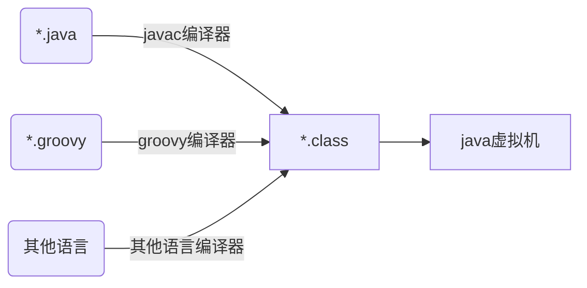

[TOC]

## 目标

* 了解Java字节码相关的知识点

  参考：深入理解Java虚拟机——JVM高级特性与最佳实践(第2版) 书籍

**本文仅是从书籍内容做了记录，不过补充了一些图示，可能会更清晰一点。如果需要阅读完整内容，还请参考书籍内容。**

## 类文件结构

字节码（byte code）



class文件以c语伪结构来存储数据，两种格式无符号数，表

* 无符号数

  u1 一个字节，u2 二个字节，u4 4个字节，u8 8个字节，用来描述 数字，索引引用，数据量值 和 utf-8编码的字符串

* 表

  由多个无符号数和其他表组件，以_info 结尾

  cp_info(常量池) , field_info（字段表）, method_info（方法表） ,attribute_info（属性表）

 

## Class 类文件的结构

Class 文件以8位字节为基础的二进制流。

winhex 下载地址：[winhex](https://www.onlinedown.net/soft/1510.htm)  16进制，查看class文件，即4位为一组。

16进制转换10进制网站：https://tool.oschina.net/hexconvert/

演示代码：将如下代码编译后，生成的class文件。使用 Winhex 打开即可。

```java
package fun.gengzi.test.classshow;
 
public class GlogTest {
    private int arg1 = 1;
    public final static String INFO = "NIUPI";
    /**
     * 求和
     * @param a 参数a
     * @param b 参数b
     * @return a+b
     */
    public int sum(int a, int b) {
        return a + b;
    }
}
```

使用 Winhex  打开


### 魔数和class文件的版本

* 魔数

  0xcafebabe （咖啡宝贝？）用于标识是 class文件（不使用.class 扩展名标识这是一个class文件）

* class 文件版本

  标识当前class文件能被什么版本的虚拟机加载。低版本的java虚拟机无法加载高版本的class文件。（jdk8 版本 52）
  
  **有时候会遇到jdk8编译的工程，放在jdk7下运行，会提示Java| unsupported major.minor version 52.0**

```shell
# 按八个字节为单位
# 魔数 cafebabe 四字节
# java主版本号 0034 转为10进制 52 ，jdk8以上版本支持
cafe babe 0000 0034
```

 

### 常量池

包含两大内容：字面量 和 符号引用

* 字面量
  跟常量差不多，文本字符串，声明为final 的常量值

* 符号引用

  类和接口的全限定名称（以/分割的类名）

  字段的名称和描述符

  方法的名称和描述符

全限定名称：例如：fun/gengzi/test/classshow/GlogTest； 就是将类全名的"."替换为“/” 即可。

**从上述描述，类，接口，字段，方法它们的名称和描述符，都是在常量池中定义的，如果使用常量池索引在常量池中寻找即可**

```shell
 
# 两字节的常量池计数（从1开始） 001d ，转为10进制  29。28个常量
# 第一位是u1类型的标准位，01 CONSTANT_Utf8_info UTF-8编码的字符串
# 0027 代表字符串的长度，之后的39字节都是这个字符串的字节数据
001d 0a00 04
# 从6a -- 72 开始，都是字符串数据，比对 ascii 编码，转换内容 java/util/concurrent/ThreadPoolExecutor
6a 6176
612f 7574 696c 2f63
6f6e 6375 7272 656e
742f 5468 7265 6164
506f 6f6c 4578 6563
7574 6f72
```

 


分析class文件字节码工具 javap -verbose class文件,只关注常量池内容：

```java
PS D:\ideaworkspace> javap -verbose GlogTest.class
Classfile /D:/ideaworkspace/GlogTest.class
  Last modified 2021-2-18; size 512 bytes
  MD5 checksum aa7d67e1b7593ccaa8b2c037ea64b007
  Compiled from "GlogTest.java"
public class fun.gengzi.test.classshow.GlogTest
  minor version: 0
  major version: 52
  flags: ACC_PUBLIC, ACC_SUPER
Constant pool:
   #1 = Methodref          #4.#24         // java/lang/Object."<init>":()V
   #2 = Fieldref           #3.#25         // fun/gengzi/test/classshow/GlogTest.arg1:I
   #3 = Class              #26            // fun/gengzi/test/classshow/GlogTest
   #4 = Class              #27            // java/lang/Object
   #5 = Utf8               arg1
   #6 = Utf8               I
   #7 = Utf8               INFO
   #8 = Utf8               Ljava/lang/String;
   #9 = Utf8               ConstantValue
  #10 = String             #28            // NIUPI
  #11 = Utf8               <init>
  #12 = Utf8               ()V
  #13 = Utf8               Code
  #14 = Utf8               LineNumberTable
  #15 = Utf8               LocalVariableTable
  #16 = Utf8               this
  #17 = Utf8               Lfun/gengzi/test/classshow/GlogTest;
  #18 = Utf8               sum
  #19 = Utf8               (II)I
  #20 = Utf8               a
  #21 = Utf8               b
  #22 = Utf8               SourceFile
  #23 = Utf8               GlogTest.java
  #24 = NameAndType        #11:#12        // "<init>":()V
  #25 = NameAndType        #5:#6          // arg1:I
  #26 = Utf8               fun/gengzi/test/classshow/GlogTest
  #27 = Utf8               java/lang/Object
  #28 = Utf8               NIUPI
```

 


 

注意：java 程序中如果定义超过64kb的英文字符的变量或者方法名，将无法编译

 

### 访问标志


如果public 类，ACC_PUBLIC 和 ACC_SUPER 为 真，其他都为假 （0x0001+0x0020 = 0x0021）

**注意访问标志是各个累加出来的**

###  类索引，父类索引，接口索引

类索引 u2  父类索引 u2  接口集合索引 u2 计数

* 类索引

  确定这个类的全限定类名

* 父类索引

  确定这个类的父类全限定类名

* 接口索引集合

  确定这个类的接口集合


```shell
   0003 0004 0000
   #3 = Class              #26            // fun/gengzi/test/classshow/GlogTest  // 当前类全限定类名
   #4 = Class              #27            // java/lang/Object  // 当前类父类（Object）
   // 没有接口，所以 0000
```


### 字段表集合

包含两种：实例变量 和 类变量（被static修饰），由以下表中的内容组成


#### access_flags 访问标志

还是ACC_ 开头的那些标志位

#### name_index  简单名称

（在常量池中）

比如类中方法和字段的简单名称 arg1 和 sum() ，简单名称就是 arg1 和 sum 。

```java
private int arg1 = 1;
public int sum(int a, int b) {
        return a + b;
}
```

#### descriptor_index  描述符 

（在常量池中）

用于描述字段的数据类型和方法的参数列表


一些例子：

```shell
# 无返回值空参方法
void inc()  描述符   ()V   
# 有返回值空参方法
String inc() 描述符 ()Ljava/lang/String;
# 带参数的方法
void inc(int age) 描述符 (I)V
# 数组作为参数的方法
int inc(int age[]) 描述符 ([I)I
# 二维数组
String[][]  描述符 [[Ljava/lang/String;
 
```

 

#### 实例演示

```java
private int arg1 = 1;
```

上述参数在常量池中，常量池用于描述字段和方法的名称和描述符


### 方法表集合

跟字段表类似


#### 实例演示

上述测试代码中，包含两个方法<init> 和 sum() 。类构造器<cinit>  , 实例构造器<init> 都是编译器自动添加的方法。

**对于<cinit> 与 <init>  的功能可以看下 [区别](https://www.dazhuanlan.com/2020/01/20/5e2546cf8c7a5/)**

```java
public void <init>(){....}
```


```java
public int sum(int a, int b) {...}
```

 对比以上的说明，看下能否看懂如下的内容：


### 属性表集合

一些常用属性 


对于每个属性，它的名称需要从常量池中引用一个 CONSTANT_Utf8_info 类型的常量来表示

在上述测试代码中，常量池中可以看到

```shell
  #9 = Utf8               ConstantValue  // 字段表中的属性
  #13 = Utf8              Code  // 方法表中的属性
  #14 = Utf8               LineNumberTable  //java源码行号和字节码指令的对应关系
  #15 = Utf8               LocalVariableTable // 方法的局部变量描述
```

属性值的结构完全自定，只需要通过一个u4长度说明属性值占用的位数


**这里仅介绍 Code 这一种属性**，还有其他属性，不一一介绍。比如上述中  Code ，LineNumberTable ，LocalVariableTable 都是一种属性

#### code 属性

java程序**方法体**代码经过javac编译后，最终变成了字节码存放在code属性中


分析class文件字节码工具 javap -verbose 分析一下


 在看下16进制数据


### 最后

再看这张图片，使用了二进制流的形式，描述了一个class文件的内容。


