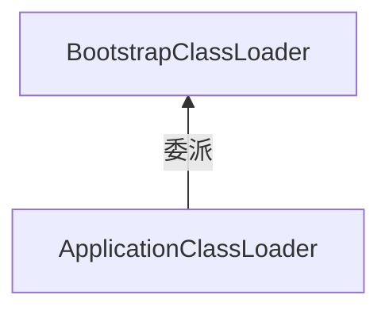
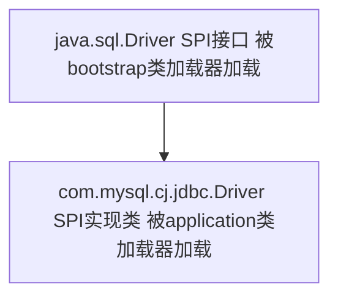
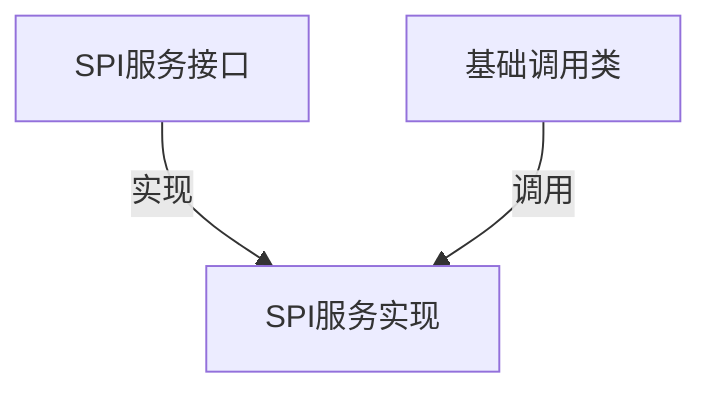

[TOC]

## 目标

* 了解线程上下文类加载的作用和用法

  参考：深入理解Java虚拟机——JVM高级特性与最佳实践(第2版) 书籍

  [mermaid](https://mermaid-js.github.io/mermaid/#/)

  [你知道java反射机制中class.forName和classloader的区别吗？](https://baijiahao.baidu.com/s?id=1654865863100987859&wfr=spider&for=pc)

  [JAVA之SPI-服务发现机制](https://blog.csdn.net/lizz861109/article/details/102694262)

### 引入问题

如何破坏类加载器的双亲委派模型？（转换为更简单的问题：如何让父类加载器（Bootstrap ClassLoader）加载的类调用子类加载器（Application ClassLoader）加载的类）

> 注意：由于双亲委派模型，子类加载器加载的类可以引用父类加载器加载的类，父类加载器加载的类无法引用子类加载器加载的类

为了解决基础类调用回用户的代码，java引入了线程上下文类加载器（Thread Context ClassLoader）作为一种方式来实现。

## 线程上下文类加载器

线程上下文类加载器（Thread Context ClassLoader）

基本方法：

```java
// 设置线程的上下文类加载器
Thread.currentThread().setContextClassLoader(ClassLoader.getSystemClassLoader());    
// 获取当前线程的上下文类加载器
ClassLoader contextClassLoader = Thread.currentThread().getContextClassLoader();
```

获取线程上下文类加载器的三种情况：

* 全局范围内没有设置过上下文类加载器，默认类加载器就是应用类加载器（Application ClassLoader）
* 创建线程但没有设置上下文类加载器，将从父线程继承一个类加载器
* 设置了线程的上下文类加载器，就返回设置的类加载器

再引入一个SPI 的概念

### 服务提供者接口（SPI）

服务提供者接口（Service Provider Interface），Java 提供了很多服务提供者接口（Service Provider Interface，SPI），允许第三方为这些接口提供实现。常见的 SPI 有 JDBC、JCE、JNDI、JAXP 和 JBI 等。

这些服务一般使用这个线程的上下文类加载器去加载需要的SPI接口实现的代码，也就是让父类加载器委派子类加载器完成类加载。



 

### JDBC 源码分析

通过分析jdbc 加载过程，理解如何让父类加载器委派子类加载器完成类加载。

比较详细的分析可以参考：[深入探索“线程上下文类加载器”](https://www.jianshu.com/p/05ec26e25627)

[真正理解线程上下文类加载器（多案例分析）](https://blog.csdn.net/yangcheng33/article/details/52631940)

Jdbc 操作数据库的代码，简单示例：

```java
// 装载mysql的驱动，把Driver类装载进jvm
Class.forName("com.mysql.jdbc.Driver");
// 获取数据库连接
Connection conn = DriverManager.getConnection(DB_URL, USER, PASS);
// 使用连接操作数据库
stmt = (Statement) conn.createStatement();
String sql = "SELECT * FROM xxx";
ResultSet rs = stmt.executeQuery(sql);
```

> Class.forName 将类.class 文件加载到jvm中。并且会执行static代码块，初始化静态变量。

着重分析一下 DriverManager.getConnection 过程

DriverManager 类代码：

在执行getConnection方法前，会先执行静态代码块,只看核心代码

```java
    static {
        loadInitialDrivers();
        println("JDBC DriverManager initialized");
    }
 
    private static void loadInitialDrivers() {
       // ....
     // 加载 Driver 所有实现
      ServiceLoader<Driver> loadedDrivers = ServiceLoader.load(Driver.class);
      Iterator<Driver> driversIterator = loadedDrivers.iterator();
       try{
          while(driversIterator.hasNext()) {
              driversIterator.next();
          }
       } catch(Throwable t) {
           // Do nothing
       }
        return null;
 
   // ....
    }
 
 
```

说明：ServiceLoader 是jdk提供的服务实现查找的工具类。这里引入java.sql.Driver Class，就会去Mysql jar 包 "META-INF/services/" 目录下，寻找 java.sql.Driver 命名的文件，该文件中存放所有的服务接口实现类的全限定名称（com.mysql.jdbc.Driver），具体看下load方法：

```java
    public static <S> ServiceLoader<S> load(Class<S> service) {
        // 获取线程上下文类加载器
        ClassLoader cl = Thread.currentThread().getContextClassLoader();
        // 执行load方法
        return ServiceLoader.load(service, cl);
    }
 
    public static <S> ServiceLoader<S> load(Class<S> service,
                                            ClassLoader loader)
    {
        // 创建了一个 ServiceLoader,调用有参的构造方法
        return new  ServiceLoader<>(service, loader);
    }
 
    private ServiceLoader(Class<S> svc, ClassLoader cl) {
        service = Objects.requireNonNull(svc, "Service interface cannot be null");
        loader = (cl == null) ? ClassLoader.getSystemClassLoader() : cl;
        acc = (System.getSecurityManager() != null) ? AccessController.getContext() : null;
        // 执行reload方法
        reload();
    }
 
    public void reload() {
        // LinkedHashMap<String,S> providers 用于缓存提供程序
        providers.clear();
        // 创建一个惰性迭代器
        lookupIterator = new LazyIterator(service, loader);
    }
 
 
 
```

其实就是将所有服务实现类（比如com.mysql.jdbc.Driver ，com.mysql.fabric.jdbc.FabricMySQLDriver等等），放入迭代器中，再关注下，迭代的代码实现了什么

```java
   while(driversIterator.hasNext()) {
              driversIterator.next();
          }
//  hasNext 和  next 都被重新实现了
// 具体只展示一下 next() 方法，在next 方法中将服务实现类，都创建出来（删掉了许多代码，只保留了主要的）
 
private S next() {
            String cn = nextName;
            nextName = null;
            Class<?> c = null;
            // ...
            // 使用forname 反射，将服务实现（比如 com.mysql.jdbc.Driver ）装载至jvm中，但是并没有初始化（false）,loader 就是构造 LazyIterator 传入的 classloader，也就是线程上下文类加载器（默认是 applicationClassloader 应用类加载器）
                c = Class.forName(cn, false, loader);
              // ...
            // 使用 newInstance 创建对象（使用无参的构造方法）
            S p = service.cast(c.newInstance());
            // 将服务实现类对象，设置到 缓存map中。
            providers.put(cn, p);
            return p;
        }      
 
 
```

其实在迭代所有服务实现类时，都会使用线程上下文类加载器（threadContextClassLoader）做为参数，执行forName 方法，并newInstance 调用无参构造器实例化。

```java
// java.sql.DriverManager
    private static Connection getConnection(
        String url, java.util.Properties info, Class<?> caller) throws SQLException {
          // 循环 registeredDrivers 是一个 CopyOnWriteArrayList<DriverInfo> 存放这 driver实例
        for(DriverInfo aDriver : registeredDrivers) {
            if(isDriverAllowed(aDriver.driver, callerCL)) {
                    // driver.connect 调用的代码就是 服务实现类（比如com.mysql.cj.jdbc.Driver）实现的内容
                    Connection con = aDriver.driver.connect(url, info);
                    if (con != null) {
                        return (con);
                    }
            }
```

基于上述的代码，可以看到 基础类（jdk中的DriverManager）回调用户的代码（com.mysql.cj.jdbc.Driver 的connect 方法）。 在 DriverManager.getConnection 方法中，调用了 Driver 的 connect 用于获取数据库连接。



```shell
spijava.sql.Driver   # SPI 接口  #bootstrapClassLoader
com.mysql.cj.jdbc.Driver # SPI 实现类  # appClassLoader
```

 

## 代码实践

需求： 模拟上述JDBC使用SPI的方式在基础类中回调用户的代码

开发环境：JDK1.8

思路： 需要创建SPI服务接口和基础调用类（在Bootstrap Calssloader下加载，跟JDK加载核心包是同一个classloader），创建SPI服务实现（在appClassloader下加载），用于基础调用类调用SPI的服务实现。

目的：1， 测试在双亲委派模型下，父类加载器加载的类能否调用子类加载器加载的类。

2， 使用线程上下文类加载器（ThredContextClassLoader）破坏双亲委派模型

流程图：



需要创建两个工程，

工程一： spi接口和基础调用类需要打成jar包追加在bootstrap加载。(父，类加载器)

工程二： 我们自己的程序，实现spi服务接口并调用（子，类加载器）

（jvm 命令，用于将该jar使用bootstrap classloader 加载： -Xbootclasspath/a:D:/ideaworkspace/base.jar）

### 工程一

新建工程步骤省略，最简单的java工程就可以,或者maven工程

#### SPI 服务接口

很简单，只有一个方法。

```java
 
/**
* <h1>SPI接口</h1>
*/
public interface SpiService {
 
    /**
     * 连接
     *
     * @return
     */
    String conn();
}
```

#### 基础调用类

这里没有使用 ServiceLoader 去自动扫描具体的服务实现类名，这里直接指定了（”fun.gengzi.test.classshow.SpiServiceImpl“） 这个就是spi服务实现的全限定名称，具体自己的实现的包名类名，自行修改。

```java
import java.util.ArrayList;
import java.util.List;
 
/**
* <h1>基础调用类</h1>
*/
public class SpiUse {
 
    // 保存所有服务实现
    public static List<SpiService> spiServiceList = new ArrayList<>();
 
    static {
        try {
              System.out.println("thread context classloader :" + Thread.currentThread().getContextClassLoader());
            // TODO 测试1：测试不使用线程上下文类加载器，也就是遵循双亲委派模型，加载类
            // 通过反射获取SPI服务实现类，并创建
            Class<?> aClass = Class.forName("fun.gengzi.test.classshow.SpiServiceImpl");
            // TODO 测试2：注释上述代码，放开下面代码，测试使用线程上下文类加载器破坏双亲委派模型
            //      Class<?> aClass = Class.forName("fun.gengzi.test.classshow.SpiServiceImpl", true, Thread.currentThread().getContextClassLoader());
 
            Object o = aClass.newInstance();
            spiServiceList.add((SpiService) o);
        } catch (ClassNotFoundException e) {
            e.printStackTrace();
        } catch (IllegalAccessException e) {
            e.printStackTrace();
        } catch (InstantiationException e) {
            e.printStackTrace();
        }
    }
 
    /**
     * 工具方法
     *
     * @return
     */
    public static String conn() {
        // 仿照DriverManager.getConnection,循环所有的服务实现，有一个成功就返回（其实我们这里只有一个实现）
        for (SpiService spiService : spiServiceList) {
            return spiService.conn();
        }
        return null;
    }
 
}
```

#### 打包

关于打jar包注意：需要在artifacts添加 Jar-> From model..  。然后 Build->Build Porject 就可以了


将打包好的jar，拷贝至一个目录中，方便使用。我拷贝到本地的：D:\ideaworkspace\base.jar

> 注意：测试两种情况，要分别修改代码，并重新打包，拷贝至之前的目录覆盖之前的jar

### 工程二

省略新建工程的步骤

#### 导入base.jar包

将base.jar 引入当前工程,才能引用需要的类


#### SPI 服务实现

这里实现很简单，就返回了一个文本

```java
import com.gengzi.base.SpiService;
 
/**
* <h1>服务接口实现</h1>
*/
public class SpiServiceImpl implements SpiService {
    @Override
    public String conn() {
        return "---conn---";
    }
}
 
```

#### 测试代码

```java
import com.gengzi.base.SpiUse;
 
public class SpiTest {
 
    public static void main(String[] args) {
        String conn = SpiUse.conn();
        System.out.println(conn);
    }
 
}
```

### 测试

执行上述测试代码main方法时，请加入jvm 的参数命令，将base.jar 使用bootstrap classloader 加载。

```
-Xbootclasspath/a:D:\ideaworkspace\base.jar
```


#### 测试1:

```java
  // TODO 测试1：测试不使用线程上下文类加载器，也就是遵循双亲委派模型，加载类
   Class<?> aClass = Class.forName("fun.gengzi.test.classshow.SpiServiceImpl");
```

结果：

```java
thread context classloader :sun.misc.Launcher$AppClassLoader@18b4aac2
null
java.lang.ClassNotFoundException: fun/gengzi/test/classshow/SpiServiceImpl
    at java.lang.Class.forName0(Native Method)
    at java.lang.Class.forName(Class.java:264)
    at com.gengzi.base.SpiUse.<clinit>(SpiUse.java:18)
    at fun.gengzi.test.classshow.SpiTest.main(SpiTest.java:8)
 
Process finished with exit code 0
```

根据上述信息：在基础类中，无法找到SpiServiceImpl 这个类。也就是说，在遵循双亲委派模型的情况下，父类加载器加载的类无法调用子类加载器加载的类

#### 测试2：

```JAVA
// TODO 测试2：注释上述代码，放开下面代码，测试使用线程上下文类加载器破坏双亲委派模型
Class<?> aClass = Class.forName("fun.gengzi.test.classshow.SpiServiceImpl", true, Thread.currentThread().getContextClassLoader());
```

结果：

```java
thread context classloader :sun.misc.Launcher$AppClassLoader@18b4aac2
---conn---
 
Process finished with exit code 0
```

成功了，实现了在基础类中调用了用户代码，就是依靠于线程上下文类加载器。